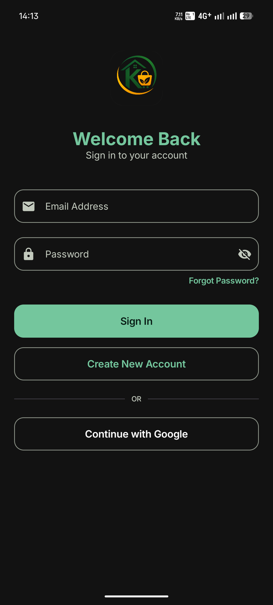
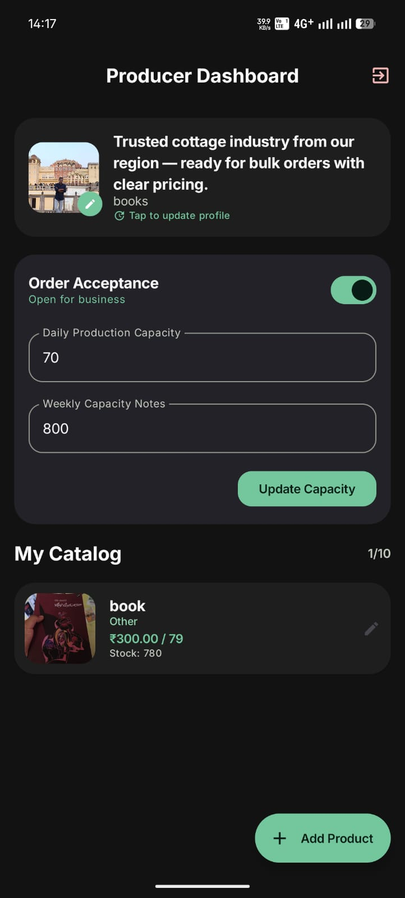
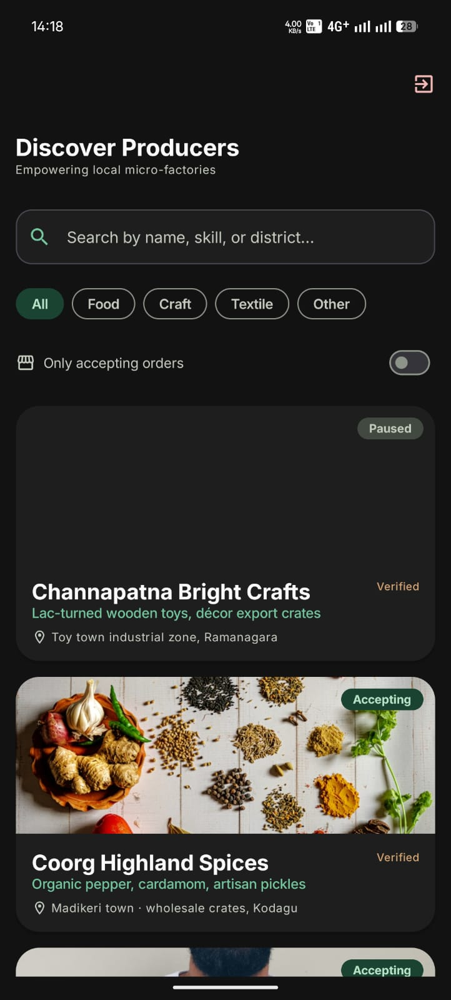
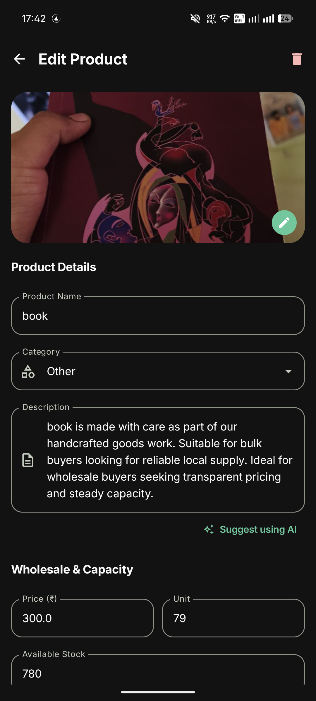
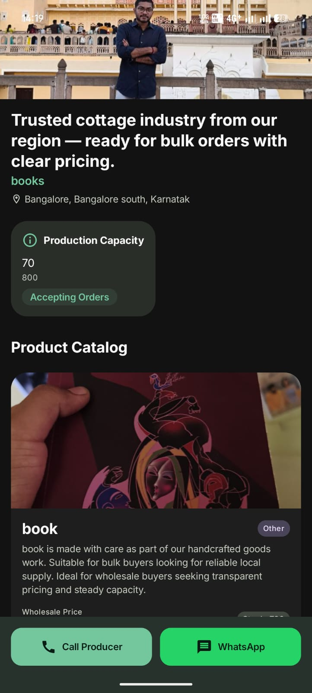
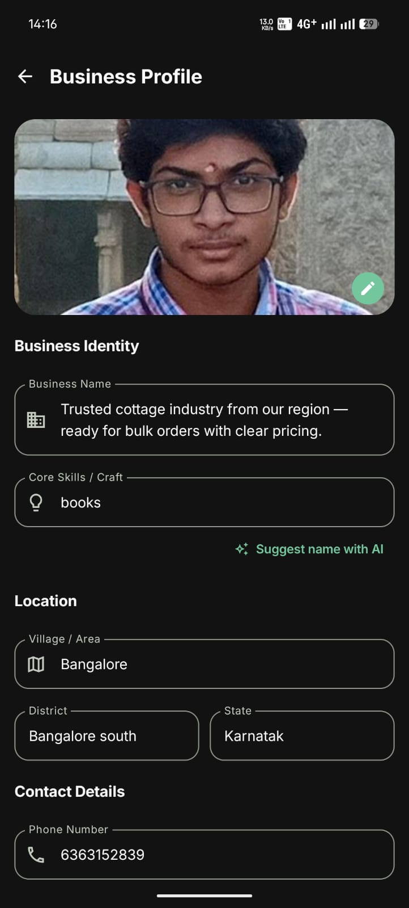

# Kutira Kushala (ಕುಟೀರ ಕುಶಲ)

**Kutira Kushala** is a professional-grade Android application designed to bridge the gap between local cottage industries (micro-factories) and wholesale buyers. Built with a modern tech stack, it empowers rural and semi-urban producers by providing them with a digital storefront to showcase their craftsmanship and production capacity.

---

## 🚀 Problem Statement

Traditional micro-factories and cottage industries often lack direct access to wholesale markets. Buyers, on the other hand, struggle to find reliable local producers with specific skills and transparent production capacities. **Kutira Kushala** solves this by:
- Digitizing producer catalogs.
- Providing real-time production capacity updates.
- Enabling direct peer-to-peer communication via WhatsApp and Phone.
- Simplifying the discovery process through category-based filtering.

---

## ✨ Features

### For Producers
- **Digital Storefront:** Create and manage a professional business profile.
- **Product Management:** Upload products with images, wholesale pricing, and descriptions.
- **Capacity Dashboard:** Set and update daily/weekly production limits to manage buyer expectations.
- **AI Assistance:** Generate professional product descriptions and business taglines using integrated AI templates.
- **Order Control:** Toggle order acceptance status instantly.

### For Buyers
- **Producer Directory:** Discover verified local micro-factories.
- **Advanced Filtering:** Filter by product category (Food, Craft, Textile, etc.) and availability.
- **Transparent Catalog:** View detailed product specifications and wholesale prices.
- **Direct Contact:** One-tap calling and WhatsApp messaging to initiate trades.

---

## 🛠 Tech Stack

- **Language:** Kotlin
- **UI Framework:** Jetpack Compose (100%)
- **Design System:** Material 3
- **Architecture:** MVVM (Model-View-ViewModel)
- **Backend:** Firebase (Auth, Firestore, Storage)
- **Image Loading:** Coil
- **Asynchronous Work:** Kotlin Coroutines & Flow
- **Dependency Management:** Version Catalogs (libs.versions.toml)

---

## 🏗 Architecture

The project follows a clean **MVVM Architecture** combined with the **Repository Pattern**:

- **UI Layer:** Compose-based Screens and reusable Components.
- **ViewModel Layer:** Manages UI state and business logic.
- **Repository Layer:** Abstracted data access from Firebase Firestore and Storage.
- **Model Layer:** Domain-specific data classes for Products, Businesses, and Users.

---

## 🔥 Firebase Services Used

1. **Firebase Authentication:** Secure Google and Email/Password sign-in.
2. **Cloud Firestore:** Real-time NoSQL database for business profiles and product catalogs.
3. **Firebase Storage:** High-performance storage for business and product imagery.
4. **Firebase Analytics:** Insights into user engagement.

---

## 📦 Folder Structure

```text
com.example.kutira_kushala/
├── data/
│   ├── genai/          # AI Helper for content generation
│   ├── model/          # Data models (Product, Business, etc.)
│   ├── repo/           # Repository implementations
│   └── ImageCompressor # Local utility for image optimization
├── navigation/         # NavHost and Route definitions
├── ui/
│   ├── components/     # Reusable UI widgets (Atomic Design)
│   ├── screens/        # Full-screen Compose layouts
│   ├── theme/          # Material 3 Color Schemes & Typography
│   └── viewmodel/      # State management
└── KutiraApp.kt        # Main navigation graph
```

---

## 🛠 Installation Steps

1. **Clone the Repository:**
   ```bash
   git clone https://github.com/RohithGP05/Kutira_Kushala.git
   ```
2. **Setup Firebase:**
   - Create a project on [Firebase Console](https://console.firebase.google.com/).
   - Add an Android App with package name `com.example.kutira_kushala`.
   - Download `google-services.json` and place it in the `app/` directory.
   - Enable Auth (Google/Email), Firestore, and Storage.
3. **Open in Android Studio:**
   - Use Android Studio Jellyfish or later.
   - Sync Gradle files.

---

## 🏃 How to Run

1. Connect an Android device or start an Emulator (API 24+).
2. Click **Run 'app'** in Android Studio.
3. To build a debug APK:
   ```bash
   ./gradlew assembleDebug
   ```

---

## 📸 Screenshots

| Login | Producer Home | Buyer Directory |
|-------|---------------|-----------------|
|  |  |  |

| Product Edit | Business Detail | Profile Edit |
|--------------|-----------------|--------------|
|  |  |  |

---

## 🎥 Demo Video
[Link to Demo Video (YouTube/Drive)]

---

## 🔮 Future Improvements
- **In-App Messaging:** Secure chat between buyers and sellers.
- **Payment Integration:** Secure escrow or direct payment gateway.
- **Multi-language Support:** Localized UI for various Indian regional languages.
- **Offline Sync:** Ability to edit catalogs without an active internet connection.

---

## 👥 Contributors
- **Rohith G P** - Lead Developer & Maintainer
- [Add other contributors here]
